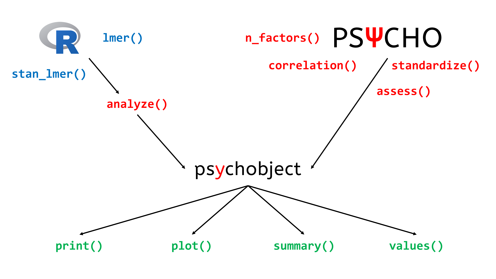

# Summary

Statistics are a vital aspect of psychological science. Unfortunately, the process of analyzing, formatting and reporting results is often fastidious, time-consuming and prone to errors, resulting in frustration and aversion. On top of that, many available tools for professionals and students are either overpriced, too complex (`i.e.`, displaying vast amounts of raw information neither demanded nor needed by the user) or too basic (`i.e.`, not supporting advanced statistical procedures). These factors contribute to the reproducibility crisis in psychological science [@Chambers2014, @Etz2016, @Szucs2016].

Psycho is an R package [@team2000r] whose main goal is to fill the gap between statistical analyses and publication-ready documents, involving information selection, results transformation and text formatting. These steps, beyond being the most time-consuming part of statistical analysis in psychological science, are the source of many human errors and can lead to a badly formatted results section, veiling the general quality of a paper. The `psycho` package, built for psychologists, neuropsychologists and neuroscientists, also implements commonly used routines such as correlation matrices, assessment plot creation or standardization. The package revolves around the psychobject, returned by most of its functions. Additionally, the `analyze()` function transforms other R objects into psychobjects. Four methods can then be applied to them: `summary()`, `print()`, `plot()` and `values()`.

A special focus has been dedicated to the support of cutting-edge statistical routines, such as mixed-models. Moreover, a specific attention has been devoted to the promotion, through support and documentation, of the Bayesian framework. Indeed, beyond the many methodological reasons to prefer this approach (better accuracy in noisy data, the possibility of introducing prior knowledge into the analysis and, critically, results intuitiveness and their straightforward interpretation; [@lee2012bayesian, @gabry2016rstanarm]), its core functioning (computing the probability of different effects compatible with the observed data) sets it as the right way of answering the questions of psychology.

Contrary to many other packages, whose goal is to produce statistical analyses, psycho bridges statistical R outputs with statistical report writing, with a focus on APA formatting guidelines, to enhance the standardisation of results reporting. Complex outputs, such as those of Bayesian and frequentist mixed models, are automatically transformed into readable text, tables, and plots that illustrate the effects. With this package, results can be easily incorporated into shareable reports and publications, promoting data exploration, saving time and preventing errors for better, reproducible, science.

The `psycho` package can be downloaded and installed from CRAN [1](https://CRAN.R-project.org/package=psycho). Source code is available from its GitHub repository [2](https://github.com/neuropsychology/psycho.R). Documentation [3](https://www.rdocumentation.org/packages/psycho), examples [4](https://CRAN.R-project.org/package=psycho/vignettes/overview.html) and issues tracker [5](https://github.com/neuropsychology/psycho.R/issues) are also provided for a user-friendly interface.

# Acknowledgements

We warmly thank all the [contributors](https://github.com/neuropsychology/psycho.R/graphs/contributors) as well as Maurice Moss for its insights.

# References

